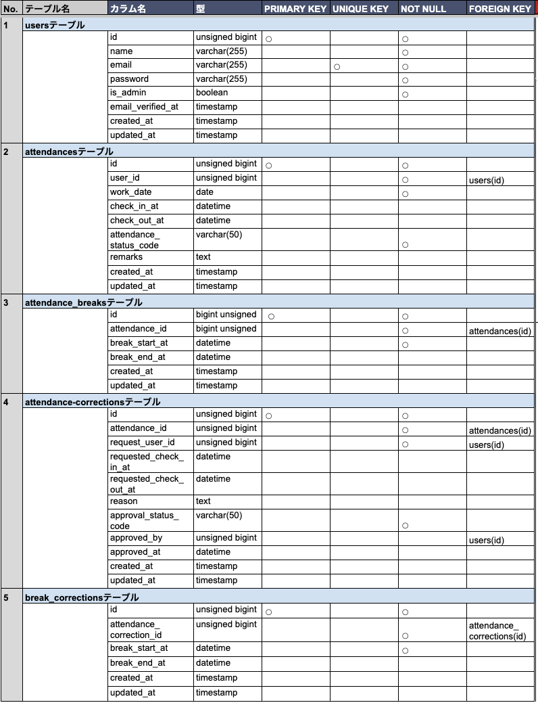
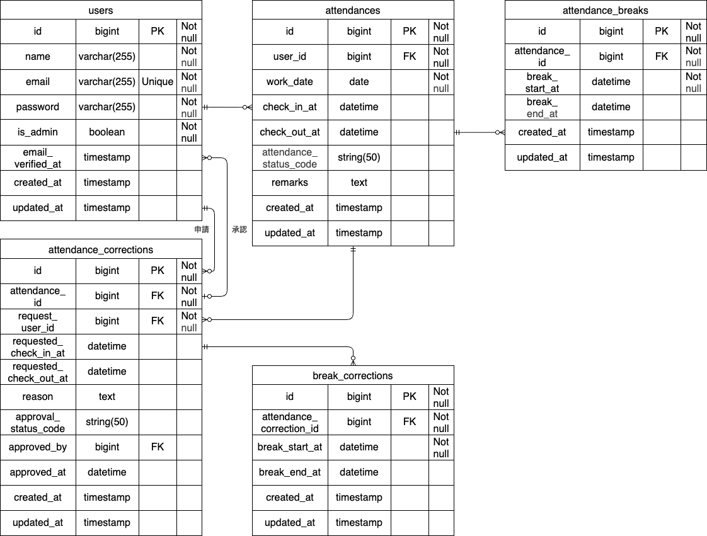

# 勤怠管理アプリ（exam-kintai）

勤怠打刻、勤怠修正申請、管理者承認を行うアプリケーションです。

## 機能

- ユーザー登録 / ログイン / メール認証（Fortify）
- 管理者ログイン（`/admin/login`）
- 打刻（出勤・退勤・休憩入・休憩戻）
- 一般ユーザー勤怠一覧（月次）・勤怠詳細
- 勤怠修正申請（複数休憩行対応）
- 申請一覧（承認待ち / 承認済み）
- 管理者による申請承認
- 管理者による全体勤怠確認（日次）
- 管理者によるスタッフ別月次勤怠確認・CSV出力

## セットアップ

### 1. 前提

- Docker Desktop
- Composer
- Sail エイリアス
- Mailtrap アカウント（メール認証確認用）

Sail エイリアスを未設定の場合:

```bash
echo "alias sail='[ -f sail ] && bash sail || bash vendor/bin/sail'" >> ~/.zshrc
exec $SHELL
```

### 2. 初期起動（推奨）

```bash
git clone https://github.com/nekomajin-1017/exam-kintai.git
cd exam-kintai
cp .env.example .env
composer install
sail up -d --build
sail artisan key:generate
sail artisan migrate:fresh --seed
```

通常起動:

```bash
sail up -d
```

停止:

```bash
sail down
```

### 3. メール設定（認証メール送信用）

`.env` の Mailtrap 設定を更新してください。

```dotenv
MAIL_MAILER=smtp
MAIL_SCHEME=null
MAIL_HOST=sandbox.smtp.mailtrap.io
MAIL_PORT=2525
MAIL_USERNAME=your_mailtrap_username
MAIL_PASSWORD=your_mailtrap_password
MAIL_FROM_ADDRESS="noreply@example.com"
MAIL_FROM_NAME="${APP_NAME}"
```

設定反映:

```bash
sail artisan config:clear
```

## テスト実行

```bash
sail test
```

## 設計資料

### テーブル設計



### 画面/設計図



## 使用技術（実行環境）

2026-04-28 時点（`composer.json` / `compose.yaml` ベース）:

- PHP: `^8.3`
- Laravel: `^13.0`
- Laravel Fortify: `^1.36`
- MySQL: `8.4`（Docker）
- phpMyAdmin: `5.2`（Docker）

## 主要 URL

- アプリ入口: `http://localhost`
  - `/` は `/attendance` にリダイレクト
  - 未ログイン時は `auth` ミドルウェアによりログイン画面へ遷移
- 一般ログイン: `http://localhost/login`
- 会員登録: `http://localhost/register`
- 管理者ログイン: `http://localhost/admin/login`
- 申請一覧: `http://localhost/stamp_correction_request/list`
- phpMyAdmin: `http://localhost:8080`
- Mailtrap Inbox: `https://mailtrap.io/inboxes`

## デモユーザー

`sail artisan migrate:fresh --seed` 実行後に利用可能:

- 一般ユーザー: `user1@example.com` 〜 `user10@example.com`
- 管理者: `admin1@example.com`, `admin2@example.com`
- 共通パスワード: `Coachtech777`
